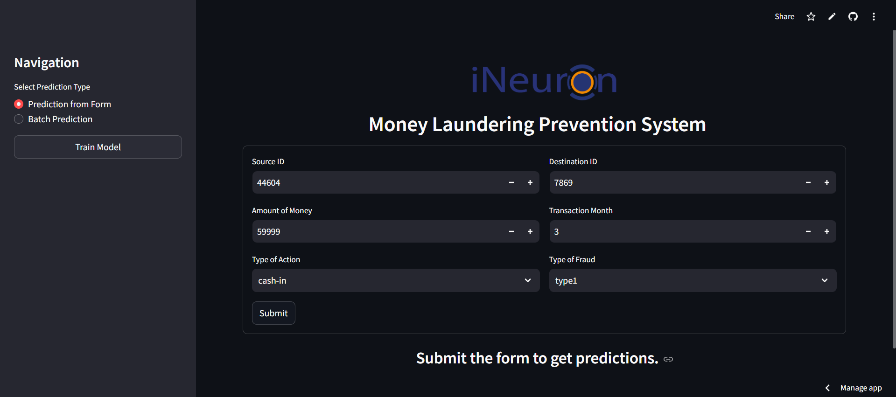

# Money Laundering Prevention

## 📌 Overview
This project implements an AI-powered **Money Laundering Prevention System** to enhance traditional rule-based **Anti-Money Laundering (AML)** solutions. Using **Machine Learning**, the system reduces **False Positives**, identifies **abnormal transaction patterns**, and optimizes operational costs. The project is built using **Python, Machine Learning, MongoDB, and Streamlit**.

## 🚀 Features
- **Fraud Detection Model**: Classifies flagged transactions as **Fraudulent** or **Not Fraudulent**.
- **Anomaly Detection**: Identifies **unusual transaction behavior**.
- **Data Storage & Retrieval**: Uses **MongoDB** for efficient transaction record management.
- **User-Friendly Interface**: Built with **Streamlit** for real-time analysis and insights.
- **Reduced False Positives**: Enhances traditional AML systems, minimizing **unnecessary investigations**.

## 🛠️ Tech Stack
- **Programming Language**: Python 🐍
- **Machine Learning**: Scikit-Learn, Pandas, NumPy
- **Database**: MongoDB
- **Web App**: Streamlit
- **Visualization**: Matplotlib, Seaborn

## 📂 Project Structure
```
📦 Money-Laundering-Prevention
 ├── 📁 EDA
      ├── money-laundering-EDA.html
      ├── money-laundering-EDA.ipnyb
 ├── 📁 assets
      ├── Streamlit UI
      ├── Project Demo Video
 ├── 📁 data                
 ├── 📁 ineuron docs
      ├── Architecture
      ├── Detailed Project Report
      ├── High Level Document
      ├── Low Level Document
      ├── Wireframe
 ├── 📁 reports
 ├── 📁 src
      ├── 📁 component
            ├── 📁 data
                  ├── ingestion.py
                  ├── tranformation.py
                  ├── validation.py
                  ├── __init__.py
            ├── 📁 model
                  ├── evaluation.py
                  ├── trainer.py
                  ├── __init__.py
      ├── 📁 core
            ├── io.py
            ├── logger.py
            ├── __init__.py
      ├── 📁 database
            ├── mongodb.py
            ├── schema.json
            ├── schema.py  
            ├── __init__.py
      ├── 📁 entity
            ├── artifact.py
            ├── config.json
            ├── saved_model.py
            ├── __init__.py
      ├── main.py
 ├── app.py
 ├── README.md               # Project documentation
 ├── requirements.txt        # Dependencies
 ```

## 🎯 Installation & Setup
1. **Clone the Repository**
```bash
   git clone https://github.com/your-username/money-laundering-prevention.git
   cd money-laundering-prevention
```
2. **Create a Virtual Environment**
```bash
   python -m venv venv
   source venv/bin/activate  # On Windows: venv\Scripts\activate
```
3. **Install Dependencies**
```bash
   pip install -r requirements.txt
```
4. **Run the Streamlit Application**
```bash
   streamlit run streamlit_app/app.py
```

## 📸 UI Screenshot


## 🤝 Contribution
Feel free to fork this repository, raise issues, and contribute! 🎉

## 📜 License
This project is licensed under the **MIT License**.
